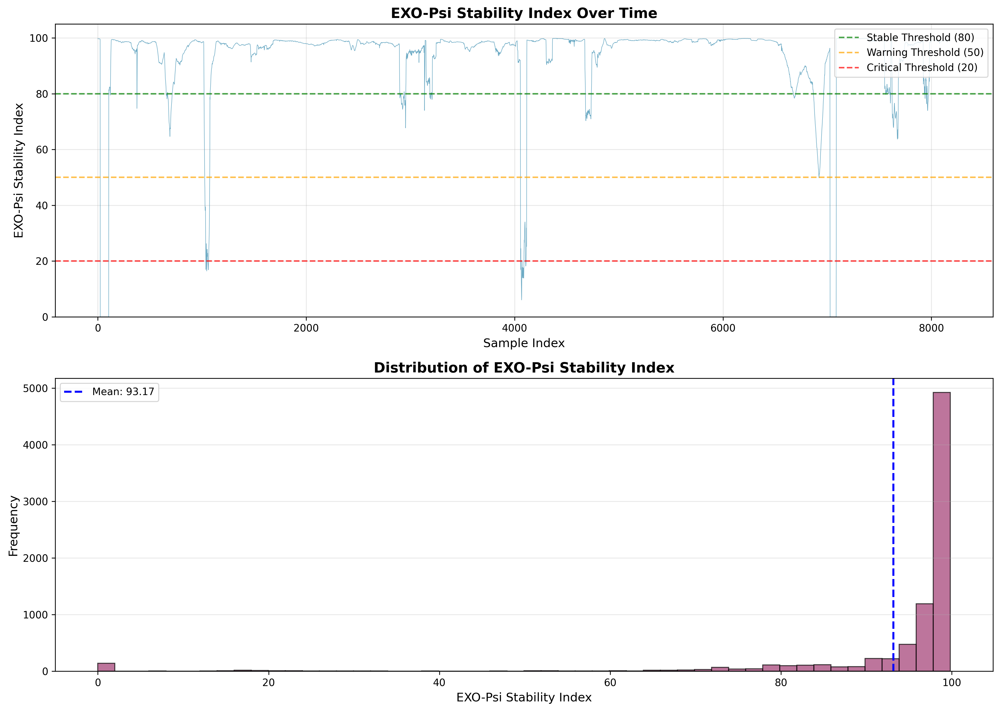

<div align="center">
  <h1>🧠 BDA Network Security & Bio-Data Analysis</h1>
  <p><i>Fusing physiological biometrics, network scraping, and environmental data for advanced predictive wellness modeling.</i></p>
</div>

---

## 🎯 The AEON Project Overview

In the modern era, our digital footprints and biological rhythms are profoundly interconnected. Are we more stressed because we're online, or are we online because we're stressed? 

This project pioneers a cross-domain data pipeline that ingests, synchronizes, and models three distinct dimensions of daily life on a minute-by-minute timescale:

1. **Digital Activity (RouterSense)**: Network logs detailing bandwidth usage, app requests, screen streaks, and domain hits.
2. **Physiological Biometrics (Garmin)**: Heart Rate, Stress Levels, Body Battery, Respiration, and Sleep quality metrics extracted from raw FIT files.
3. **Environmental Context (Weather API)**: Temperature, rain, and wind metrics affecting localized behavior.

---

## 📊 By the Numbers: Database & Model Metrics

We process massive volumes of dense, synchronized, minute-by-minute behavioral data to train our AI models:

- **Time Span Processed**: ~1 Month (Nov 5, 2025 – Dec 3, 2025)
- **Synchronized Data Volume**: **40,971 continuous rows** (discrete minutes) fusing all physical, network, and environmental sources.
- **Dimensionality**: **30 complex features** tracked per minute (including *Rolling Screen Streaks, Core Stress, Network Upload/Download MBs, Domain Ping Rates, Temperature Fluctuations*).
- **Deep Learning Matrix (`X_train`)**: Over **45,164,000** interconnected training data points evaluated across chronological structures (32,728 rolling sequence windows × 60-minute time steps × 23 parallel feature arrays).
- **LSTM Network Capacity**: **+161,600 trainable neural parameters** evaluating subconsciously invisible correlations between digital consumption and internal physiological spikes.

---

## 🤖 The ML & Analytics Ecosystem

We have developed a 4-tier analytical and Machine Learning ecosystem to interpret this dense time-series fusion:

### 1. `EXO-Model` (Biometric Autoencoder)
A specialized Variational Autoencoder (VAE) trained *exclusively* on biological data.
- **Purpose**: It learns your baseline "normal" physical state. By passing real-time biological data through the network, the resulting **reconstruction error** translates mathematically into a **Bio Stability Score**. High error indicates physical anomaly or immense strain.

### 2. `LSTM Model` (Advanced Subconscious Stress Predictor)
An Advanced Hybrid Long Short-Term Memory (LSTM) sequence-to-sequence network.
- **Purpose**: Looks at the rolling historical context (past hour of internet usage + past biometrics) to forecast cardiovascular strain and stress levels in the immediate future.

### 3. `EXO-Hypermind` (Predictive Stability Index)
A cutting-edge architecture combining **SIREN (Sinusoidal Representation Networks)** for hyperdimensional projection, unified with **Transformer Multi-Head Attention blocks**.
- **Purpose**: Calculates the overarching **EXO-Psi Stability Index** (0-100 scale), flagging systemic chronological anomalies where your digital consumption and physical states clash catastrophically.

### 4. `AEON Wellness Index`
The ultimate composite dashboard generated in `5_aeon_wellness_dashboard.py`. It combines all models and raw data into 4 weighted pillars for a singular global score (0-100):
- 🩸 **BIO (40%)**: Inverted Stress, HR, Body Battery, and the underlying Bio Stability model score.
- 💤 **SLEEP (30%)**: Sleep duration and regenerative depth.
- 🌦️ **ENV (20%)**: Climatic deviations via Temperature, Wind, and Rain.
- 📱 **COG (10%)**: Cognitive/Digital load via phone active minutes and unbroken screen-time streaks.

---

## 📈 Model Performance & Visualizations

Our comprehensive AI architecture yields highly robust physiological forecasting and stability tracking:

- **LSTM Stress Forecasting Accuracy**: Tested against an 8,183-sample test suite, the Deep LSTM predicts sequential cardiovascular strain with a strictly validated **Mean Absolute Error (MAE) of 1.13** and **RMSE of 1.39**.
- **EXO-Hypermind Anomaly Detection**: Maintains a precise **Mean PSI Score of 93.17**, cleanly identifying exactly when chronobiological stability violently drops toward `0.00` during irregular life events.
- **Network-to-Bio Behavioral Findings**: Subconscious displacement patterns confirmed deep correlations. For example, high uninterrupted `screen_streak_minutes` slightly decreases active heart rate (`-0.062` due to sedentary scrolling) while simultaneously ticking absolute psychological `stress_level` upward.
- **AEON Wellness Index**: Flushed out precisely on standard human baselines with an average composite score of **49.88 / 100** globally across the month.

<div align="center">
  <h3>The Composite AEON Wellness Dashboard</h3>
  
  <p><i>Dynamic UI detailing algorithmic scores for BIO, SLEEP, ENV, and COG pillars alongside temporal day-and-hour heatmaps.</i></p>
  
  <br/>

  <h3>Hyperdimensional PSI Tracking</h3>
  
  <p><i>EXO-Hypermind capturing anomalous physiological dips crossing standard Warning [50] and Critical [20] stability thresholds.</i></p>

  <br/>
  
  <h3>Subconscious LSTM Predictor</h3>
  
  <p><i>LSTM forecasting stress gradients versus factual physiological ground truths down to the exact minute.</i></p>
</div>

---

## ⚙️ Data Engineering Pipeline (`src/`)

Processing high-frequency biometric and scraped network data requires an exhaustive data engineering pipeline. 

- **Data Downloaders**: `download_routersense_data.js` automates Playwright to iteratively scrape UI tables from RouterSense. `download_weather_data.py` pulls historical climate data.
- **Garmin Parsing**: scripts like `parse_garmin_comprehensive.js` decode obfuscated, binary `.fit` files.
- **Feature Engineering**: `add_derived_features.py` constructs rolling thresholds, categorizes domains, and tags "screen streaks".
- **Temporal Alignment**: `merge_all_data.py` bridges the massive datasets perfectly onto a synchronized minute-to-minute temporal dimension to eliminate misalignment.

---

## 📁 Repository Structure

```text
BDA-netsec-DataAnalysis/
├── AI Models/                  # Complex Neural Ensembles
│   ├── EXO-model/              # VAE for stability indexing & biometric reconstruction
│   ├── LSTM model/             # Advanced Hybrid LSTM model for stress forecasting
│   ├── EXO-Hypermind/          # PSI scores & Transformer modeling
│   └── AEON wellness index/    # Dashboard UI & composite wellness scoring logic
│
├── src/                        # Data processing & feature engineering
│   ├── download_*.js/.py       # Data retrieval for RouterSense and Weather APIs
│   ├── parse_garmin_*.js/.py   # Binary Garmin FIT parsing
│   └── merge_*.py              # Merging pipelines across time-series sources
│
├── analysis/                   # Exploratory Data notebooks (.ipynb)
├── tests/                      # UI scraping element tests
├── docs/                       # Verbose markdown documentation
├── data/                       # (Gitignored) Raw databases, scraped tables, fit files
├── output/                     # (Gitignored) Model weights (.keras) and analysis artifacts
│
├── config.json                 # (Gitignored) Environment keys
├── package.json                # Playwright & NodeJS configs
├── requirements.txt            # Python TensorFlow & ML dependencies
└── README.md                   
```

---

## 🚀 Setup & Execution

### 1. Prerequisites
- Node.js (v14+)
- Python 3.9+
- RouterSense Dashboard Access
- Garmin Connect Data Export files

### 2. Install Dependencies
```bash
# Node packages (for the RouterSense scraper and FIT parser)
npm install

# Python packages (for AI models and DataFrame manipulation)
pip install -r requirements.txt
```

### 3. Environment Config
Copy the example config and add your RouterSense Device PID.
```bash
cp config.example.json config.json
```

### 4. Running the Pipeline
You can trigger the entire data lifecycle in phases:

1. **Fetch RouterSense Data**: `node src/download_routersense_data.js <YYYY-MM-DD>`
2. **Parse Garmin `.fit` Files**: `node src/parse_garmin_comprehensive.js`
3. **Merge Datasets**: `python src/merge_all_data.py`
4. **Feature Engineering**: `python src/add_derived_features.py`
5. **View Dashboard**: Run the AEON Python scripts inside the `AEON wellness index/` folder.

---

## 🔒 Privacy & Security

**Important:** This project orchestrates highly sensitive physical health and private browsing metrics. 
The repository's `.gitignore` guarantees that all `*.csv`, `*.fit`, `*.db`, and massive model `.npy`/`.keras` weights stay localized to your specific machine.

**Do not publicly commit:**
- Your actual `config.json`
- Any downloaded scraped `.csv` data
- The `health_net_features_2_normalize.csv` ultimate fusion database

---
*MIT License - Built for Advanced Biological and Network Systems Analytics.*
